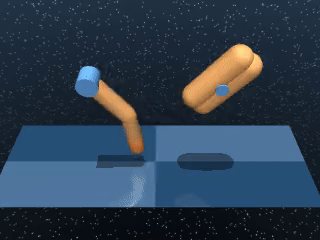
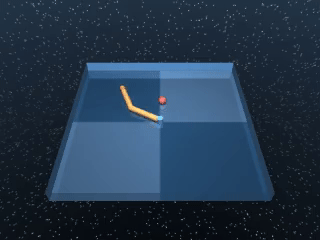
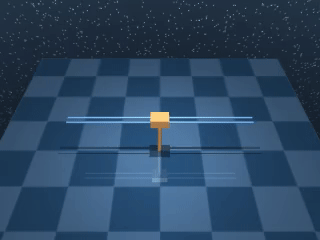
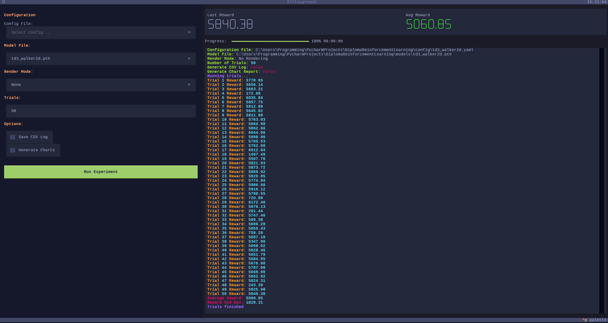

## Reinforcement learning for robotics and complex simulated environments
This repository contains implementation of my Diploma thesis focused on Deep Reinforcement Learning.
The environments I want to solve are mainly from robotics domain; though there might be some other simulated 
environments as well, if there is enough time and computational resources ;)

### Implemented algorithms:
All the implementations are self-contained, meaning that the logic -- optimization methods, training loops, 
neural networks, etc. -- are kept in a single directory that corresponds to each algorithm. The only code shared amongst 
the algorithms is for saving data, logging (Weights & Biases) and environment control (Gymnasium). This keeps the implementations
more clear, for a price of very slight redundancy.

- [x] Proximal Policy Optimization (PPO)
- [x] Soft Actor-Critic (SAC)
- [x] Twin Delayed Deep Deterministic Policy Gradient (TD3)

### Environments to solve:
- [x] MuJoCo
  - [x] Swimmer-v5
  - [x] Hopper-v5  
  - [x] HalfCheetah-v5
  - [x] Walker2D-v5
- [x] DeepMind Control Suite
  - [x] Finger Spin
  - [x] Reacher
  - [x] Cartpole Swingup

### Trained models:
Trained models, which were used in thesis for benchmarks, are stored in ```models/``` folder. You can also find them 
alongside videos & benchmarking data on [Hugging Face](https://huggingface.co/collections/ItsTSV/robodrl)

### Training logs and videos:
Training logs, charts etc. are stored using Weights & Biases. Can be either offline or online (with user account)

### Training and testing agents
Both scripts must be run from Root Directory -- if they are not, the paths and imports might be broken.

Training: ```python -m src.main --config <config path>```

Testing: ```python -m src.playground```

Benchmarking against StableBaselines3: ```python -m src.benchmark --env <environment> --alg <algorithm>```

### Dependencies
The code is written in Python 3.11. All major dependencies are listed in requirements.txt. They can be installed
via this command:

```pip install -r requirements.txt```

Note: One of the dependencies is CUDA-enabled PyTorch. Requirements list version that works with CUDA 12.8.
If you have different version, you will have to install PyTorch manually.

### Code quality
For formatting and linting, black and pylint are used. Black sometimes loves to produce a bit weird looking code,
but it is a standard in Python ecosystem, so the code looks weird pretty much everywhere ;) The code quality is checked
with every commit using GitHub Actions.

Format source code: ```black src```

Run linter: ```pylint src```

### Benchmark Results
The trained models were evaluated on 100 trials; the table shows mean and std reward values.

| Environment        |      PPO       |      SAC      |      TD3       |
|:-------------------|:--------------:|:-------------:|:--------------:|
| **Swimmer-v5**     |   345 +- 3.0   |      --       |       --       |
| **Hopper-v5**      |  2625 +- 65.1  |  1669 +- 366  |  2201 +- 691   |
| **HalfCheetah-v5** | 3105 +- 494.7  | 7250 +- 89.0  | 9802 +- 708.4  |
| **Walker2d-v5**    | 3930 +- 1585.3 | 3660 +- 581.1 | 5030 +- 1711.6 |

### Trained agents
Because moving images are a bit more interesting than static text ;)

| Hopper-v5  |           Swimmer-v5            |             HalfCheetah-v5               | Walker2D-v5 |
| :---: |:-------------------------------:|:----------------------------------------:| :---: |
|  |  |  |  |

|           Finger Spin            |   Reach    |                 Cartpole Swingup                  |
|:--------------------------------:|:----------:|:-------------------------------------------------:|
|  |  |  |

### Playground
The code comes with a terminal based playground for testing trained agents and visualizing their behavior.


